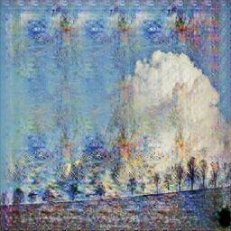

# 🎨 Monet Style Transfer API

<div align="center">
  
  
  
  
</div>

<p align="center">
  
  ➡️
  
</p>

## 📖 Overview

Transform ordinary photos into beautiful Monet-style paintings using our AI-powered style transfer service. This project provides a FastAPI-based web service that utilizes a CycleGAN model trained on Kaggle to reimagine your photos in the distinctive style of Claude Monet.

### 🔍 What is Style Transfer?

Style transfer is a technique in computer vision that applies the visual style of one image to the content of another. In this project, we use a specific type of Generative Adversarial Network (CycleGAN) that has learned the characteristics of Monet's painting style from a dataset of his works.

## 🗂️ Project Structure

- `monet_generator_fastapi/` - Backend FastAPI application
  - `saved_model/` - TensorFlow SavedModel directory containing the trained CycleGAN model
  - `samples/` - Sample input/output image pairs for testing and demonstration
  - `app.py` - FastAPI application for serving the model
  - `requirements.txt` - Python dependencies

- `dl-front/` - Next.js frontend application
  - Provides a user-friendly interface for uploading images and viewing results

- `docker-compose.yml` - Docker configuration for running the complete application stack
- `Dockerfile` - Container definition for the FastAPI backend

## 🏗️ Architecture

```
┌─────────────┐     ┌──────────────────┐     ┌─────────────┐
│             │     │                  │     │             │
│  Next.js    │────▶│  FastAPI Server  │────▶│  CycleGAN   │
│  Frontend   │◀────│                  │◀────│  Model      │
│             │     │                  │     │             │
└─────────────┘     └──────────────────┘     └─────────────┘
      ▲                      │
      │                      ▼
      │               ┌─────────────┐
      └───────────────│  Response   │
                      │  Image      │
                      └─────────────┘
```

- **Frontend**: Provides intuitive image upload and gallery viewing 
- **FastAPI Server**: Handles requests, preprocesses images, and serves predictions
- **CycleGAN Model**: Transforms photos to Monet-style paintings
- **Docker**: Encapsulates the application for easy deployment

## 🚀 Setup and Installation

### Prerequisites

- Python 3.11+ 📦
- pip 🔧
- Node.js and npm (for the frontend) 🌐

### Backend Installation

1. Create a virtual environment (recommended):
```bash
python -m venv venv
source venv/bin/activate  # On Windows: venv\Scripts\activate
```

2. Install the dependencies:
```bash
pip install -r monet_generator_fastapi/requirements.txt
```

### Frontend Installation

1. Navigate to the frontend directory:
```bash
cd dl-front
```

2. Install dependencies:
```bash
npm install
```

## 🏃‍♂️ Running the Application

### Starting the Backend API

```bash
cd monet_generator_fastapi
python app.py
```

The server will start on port 8000 by default. You can access:
- API documentation: http://localhost:8000/docs
- API statistics: http://localhost:8000/stats

### Starting the Frontend

```bash
cd dl-front
npm run dev
```

The frontend will be available at http://localhost:3000

### Using Docker Compose (Recommended)

To run the entire stack:

```bash
docker-compose up
```

This will start both the frontend and backend services in containers.

## 🔌 Using the API

### Web Interface

The web interface allows uploading images through a simple, intuitive form and displays the transformed results.

### API Endpoints

#### **Generate Monet-style image**
```
POST /generate/
```


## 🧠 How It Works

### CycleGAN Architecture

This project uses a CycleGAN (Cycle-Consistent Generative Adversarial Network) to perform unpaired image-to-image translation.


Key components:
1. **Generator G**: Transforms photos to Monet-style paintings
2. **Generator F**: Transforms Monet paintings to photo-realistic images
3. **Discriminator D_X**: Distinguishes between real photos and generated photos
4. **Discriminator D_Y**: Distinguishes between real Monet paintings and generated paintings

The model is trained with cycle consistency loss to ensure that transforming a photo to a painting and back to a photo preserves the original content.

## 🔧 Performance Optimization

The model has been optimized for inference with the following techniques:
- TensorFlow SavedModel format for efficient loading
- Batch processing capabilities for handling multiple images
- Memory management to prevent GPU memory leaks

## 📊 Limitations and Future Work

- Current model works best with landscape and nature scenes
- Performance may vary on portraits or urban scenes
- Future improvements:
  - Fine-tuning on a wider variety of image types
  - Implementing additional artistic styles
  - Improving inference speed for larger images


